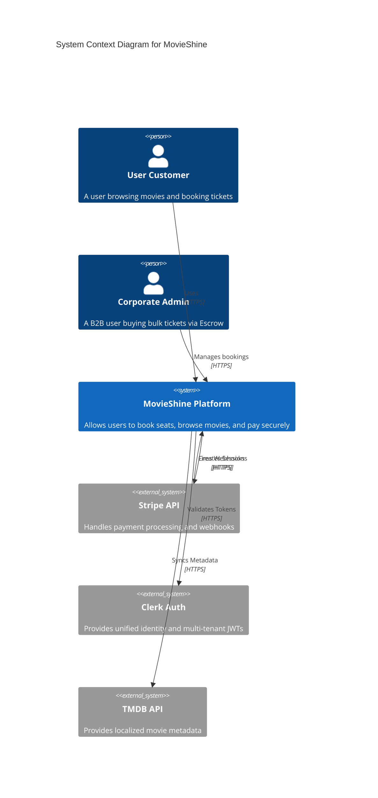

# System Architecture Overview

## 1. Executive Summary

MovieShine is engineered to handle high-throughput cinematic transaction processing. The system must guarantee data consistency during concurrent seat booking attempts, ensure zero double-booking, and maintain a highly available catalog for local search.

This document outlines the macro-level architecture of MovieShine, detailing the boundaries between our core decoupled services, the data flow, and the overarching infrastructure strategies.

## 2. Context Diagram (C4 Model Abstraction)

The system is logically partitioned into three major service domains communicating over HTTP/REST within the Node.js context. 

## 3. Service Boundaries

We adhere to a Service-Oriented Architecture (SOA). While physically deployed as a monolithic Express.js server to optimize early-stage infrastructure costs, the logical boundaries are strictly maintained to allow future microservice extraction.

### 3.1. Booking Service (Core Transaction Engine)
- **Responsibility**: Manages the critical path of seat locking, escrow negotiations (for Coporate), and transaction finality.
- **Key Challenges**: Race conditions during high-demand movie releases.
- **Resolution**: Strict Document-Level locking in MongoDB.

### 3.2. Catalog Service (Discovery & Inventory)
- **Responsibility**: Manages the ingestion of TMDB data, mapping movies to physical theater layouts, and executing geo/time-based aggregation queries.
- **Key Challenges**: Heavy read-to-write ratio.
- **Resolution**: High utilization of MongoDB `$lookup` with strict indexing on `startTime` and `movieId`.

### 3.3. Identity Service (Auth & RBAC)
- **Responsibility**: Offloads password hashing, session management, and JWT signing to Clerk.
- **Key Challenges**: Validating permissions (Admin vs Regular User vs Corporate Member) across rapid requests.
- **Resolution**: Global Edge-compatible middleware injecting tenant claims into the Request context.

## 4. Data Storage Strategy

We use **MongoDB** as our primary persistent datastore. 

> [!WARNING]
> While NoSQL is schema-less, we enforce strict schemas at the application layer via Mongoose to prevent data corruption in our billing pipelines.

### Data Guarantees
1.  **Atomicity**: Single-document updates are atomic. Seat locks are stored directly within the `Show` document under an `occupiedSeats` map to guarantee that a `findAndModify` operation either locks the seat completely, or rejects the request. We avoid multi-document transactions where possible to maintain high write throughput.
2.  **Eventual Consistency (Metadata)**: Movie posters and synopsis data are cached and eventually consistent with TMDB upstream APIs.

## 5. Security Posture

1.  **Secret Management**: Avoid `.env` leakage. All deployment secrets are injected at runtime.
2.  **Payment Security**: The server never touches raw PAN (Primary Account Number) data. Stripe Checkout securely hosts the payment element. Idempotency keys are explicitly evaluated on the backend upon webhook ingestion.
