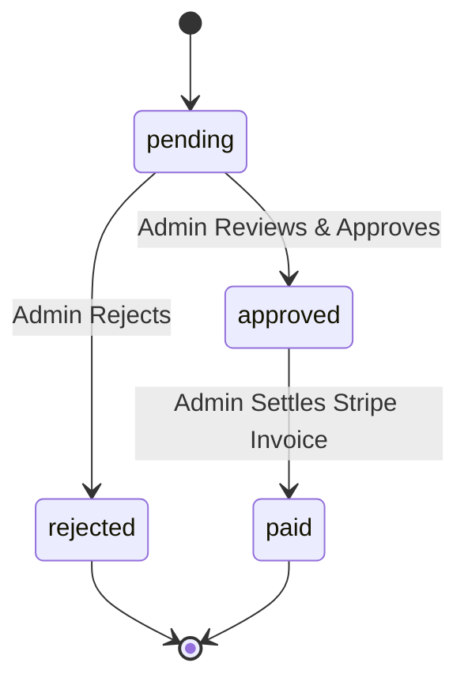

# Booking Engine Logic

## 1. Overview
The Booking Service is the heart of MovieShine. It is responsible for translating user desires to sit in a specific physical chair into a cryptographic financial transaction. It handles B2C (individual users) and B2B (Corporate Escrow) flows.

## 2. Concurrency Control (Seat Locking)
Double-booking a seat is the cardinal sin of ticketing systems. MovieShine prevents this through database-level optimistic concurrency.

### The Locking Mechanism
Instead of maintaining a separate "Locks" table, we embed seat states directly into the `Show` document. This allows us to use MongoDB's `findOneAndUpdate` to atomically verify that a seat is available and mark it as occupied in a single, indivisible operation.

```json
// Example Show Document Fragment
{
  "_id": "show_123",
  "occupiedSeats": ["A1", "A2", "C4"] 
}
```

When a user attempts to book `["A1", "B1"]`, the system executes:
```javascript
db.shows.findOneAndUpdate(
  { _id: "show_123", occupiedSeats: { $nin: ["A1", "B1"] } },
  { $push: { occupiedSeats: { $each: ["A1", "B1"] } } }
);
```
If `A1` is already in the array, the query matches no documents, and the transaction is aborted, guaranteeing 100% safety.

## 3. Transaction State Machine
The typical flow for a standard user:
1. **Selection:** UI calculates the cart total.
2. **Locking (Payment Pending):** The server issues a Stripe Checkout URL. Seats are marked in `occupiedSeats`. 
3. **Fulfillment (Webhook):** Stripe hits our `webhook` endpoint. The booking record is marked `CONFIRMED`.

> [!CAUTION]
> If a payment fails or expires, a scheduled job (or webhook failure event) must explicitly `$pull` the locked seats from `occupiedSeats` and mark the booking `FAILED` so they become available to the public again.

## 4. Corporate & Group Escrow Workflow
Corporate accounts require admin approval before capital is deployed.

### The Escrow Lifecycle

1.  **Escrow Entry:** The employee submits a request. The system *immediately locks* the seats so the public cannot take them, but flags the transaction as `pending`.
2.  **Gatekeeping:** The designated corporate admin sees the request. 
3.  **Settlement:** Approval generates a B2B Stripe Session. Payment sets the status to `paid` and triggers GST-compliant invoice generation.
